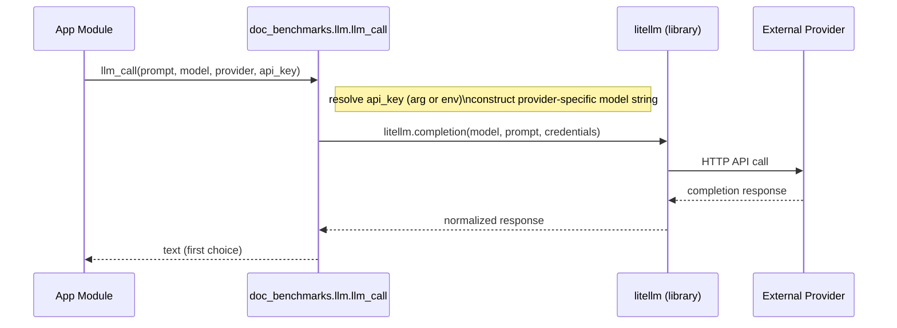

<!-- This is an auto-generated comment: summarize by coderabbit.ai -->
<!-- This is an auto-generated comment: review paused by coderabbit.ai -->

> [!NOTE]
> ## Reviews paused
> 
> It looks like this branch is under active development. To avoid overwhelming you with review comments due to an influx of new commits, CodeRabbit has automatically paused this review. You can configure this behavior by changing the `reviews.auto_review.auto_pause_after_reviewed_commits` setting.
> 
> Use the following commands to manage reviews:
> - `@coderabbitai resume` to resume automatic reviews.
> - `@coderabbitai review` to trigger a single review.
> 
> Use the checkboxes below for quick actions:
> - [ ] <!-- {"checkboxId": "7f6cc2e2-2e4e-497a-8c31-c9e4573e93d1"} --> ▶️ Resume reviews
> - [ ] <!-- {"checkboxId": "e9bb8d72-00e8-4f67-9cb2-caf3b22574fe"} --> 🔍 Trigger review

<!-- end of auto-generated comment: review paused by coderabbit.ai -->
<!-- walkthrough_start -->

📝 Walkthrough

## Walkthrough

Centralizes LLM access by adding doc_benchmarks.llm (litellm wrapper), replaces LangChain usages across evaluation/persona/question modules, updates requirements to litellm, and changes _retrieve_docs to optionally return and propagate retrieval metadata through answer generation.

## Changes

|Cohort / File(s)|Summary|
|---|---|
|**LLM abstraction**   `doc_benchmarks/llm.py`|New module: synchronous `llm_call(prompt, model, provider="openai", api_key=None)`, provider API-key resolution, litellm invocation, small `ChatOpenAI`/`ChatAnthropic` shims, and `LANGCHAIN_AVAILABLE` compatibility flag.|
|**Answering / Retrieval**   `doc_benchmarks/eval/answerer.py`|Switched imports to `doc_benchmarks.llm`; `__init__` stores `api_key` and explicitly instantiates provider LLMs; `_retrieve_docs` adds `return_metadata: bool` and optionally returns metadata; `_generate_answer_pair` requests and propagates retrieval metadata.|
|**Judging / Evaluation**   `doc_benchmarks/eval/judge.py`|Imports now from `doc_benchmarks.llm`; stores `self.api_key`; retains provider-based LLM instantiation and updates missing-dependency messaging.|
|**Persona & Question generation**   `doc_benchmarks/personas/generator.py`, `doc_benchmarks/questions/llm_gen.py`|Replaced LangChain imports with centralized llm imports; add `self.api_key`; route LLM calls via wrapper; `QUESTION_GENERATION_PROMPT` expanded/structured in `llm_gen.py`.|
|**Question validation**   `doc_benchmarks/questions/validator.py`|Replaced LangChain imports; added `api_key` param/storage; reordered attribute initialization; uses OPENAI_AVAILABLE checks; adds pure‑Python cosine fallback when NumPy absent; preserves deduplication/validation logic.|
|**Tests / Demo**   `test_e2e_simulation.py`, `tests/*`|Added pytest-skip guard in demo script; updated ImportError expectation strings and some test inputs; tests adapted for OPENAI/LANGCHAIN availability mocks; one test adds subprocess failure patch.|
|**Dependencies**   `requirements.txt`, `requirements-test.txt`|Removed LangChain-related dependencies and added `litellm>=1.74.0` to requirements and test requirements.|

## Sequence Diagram(s)

## Estimated code review effort

🎯 4 (Complex) | ⏱️ ~45 minutes

## Possibly related PRs

- napetrov/doc-benchmark#15: Overlaps `answerer.py` retrieval API changes—`_retrieve_docs` metadata return and propagation.  
- napetrov/doc-benchmark#13: Modifies the `Answerer` implementation and provider initialization logic, directly related.  
- napetrov/doc-benchmark#12: Adds/changes LLM abstraction and updates question-generation/validator modules to use it, matching this PR's LLM refactor.

## Poem

> 🐰 I nibbled code and found a way,  
> A tiny wrapper hops to play,  
> Keys tucked neat, prompts leap and say,  
> Docs fetched, answers dance and sway,  
> Hooray!

<!-- walkthrough_end -->

<!-- pre_merge_checks_walkthrough_start -->

🚥 Pre-merge checks | ✅ 1 | ❌ 2

### ❌ Failed checks (2 warnings)

|     Check name     | Status     | Explanation                                                                                                                                                                      | Resolution                                                                                                                                                                                                                                                            |
| :----------------: | :--------- | :------------------------------------------------------------------------------------------------------------------------------------------------------------------------------- | :-------------------------------------------------------------------------------------------------------------------------------------------------------------------------------------------------------------------------------------------------------------------- |
|  Description check | ⚠️ Warning | The PR description does not match the provided template structure. The template expects test coverage documentation, but this PR is a refactor replacing LangChain with litellm. | Update the description to follow the repository template or clarify that this PR uses a different template than expected. Address the functional regressions noted: api_key parameter silently ignored, QuestionValidator behavior changes, and missing test updates. |
| Docstring Coverage | ⚠️ Warning | Docstring coverage is 51.72% which is insufficient. The required threshold is 80.00%.                                                                                            | Write docstrings for the functions missing them to satisfy the coverage threshold.                                                                                                                                                                                    |

✅ Passed checks (1 passed)

|  Check name | Status   | Explanation                                                                                                                                                       |
| :---------: | :------- | :---------------------------------------------------------------------------------------------------------------------------------------------------------------- |
| Title check | ✅ Passed | The title 'refactor(llm): drop langchain, unify via litellm' clearly and concisely summarizes the main change—replacing langchain with a unified litellm wrapper. |

✏️ Tip: You can configure your own custom pre-merge checks in the settings.

<!-- pre_merge_checks_walkthrough_end -->

<!-- finishing_touch_checkbox_start -->

✨ Finishing Touches

🧪 Generate unit tests (beta)

- [ ] <!-- {"checkboxId": "f47ac10b-58cc-4372-a567-0e02b2c3d479", "radioGroupId": "utg-output-choice-group-unknown_comment_id"} -->   Create PR with unit tests
- [ ] <!-- {"checkboxId": "07f1e7d6-8a8e-4e23-9900-8731c2c87f58", "radioGroupId": "utg-output-choice-group-unknown_comment_id"} -->   Post copyable unit tests in a comment
- [ ] <!-- {"checkboxId": "6ba7b810-9dad-11d1-80b4-00c04fd430c8", "radioGroupId": "utg-output-choice-group-unknown_comment_id"} -->   Commit unit tests in branch `feature/drop-langchain-use-litellm`

<!-- finishing_touch_checkbox_end -->

<!-- tips_start -->

---

Comment `@coderabbitai help` to get the list of available commands and usage tips.

<!-- tips_end -->

<!-- internal state start -->

<!-- DwQgtGAEAqAWCWBnSTIEMB26CuAXA9mAOYCmGJATmriQCaQDG+Ats2bgFyQAOFk+AIwBWJBrngA3EsgEBPRvlqU0AgfFwA6NPEgQAfACgjoCEYDEZyAAUASpETZWaCrKPR1AGxJcKJAGZoYvgUABQeHswAlFy0FPjckB6YRAyw2hgANJDYGPB+8hLwaInqJOHMkCG2kGYAjADsWfFkWQy+1HSQAEwADF0AbGB9YF0ALNA9AKwctV0z9QBaWQJUGKmQfiTU2L4A9LHxYEkYKWnwGGDYiCRHpeWQgEmEkMzpkW4IyNW+3EkM0onJVLpMDNDDaSC7AEnIHnMCYXCwOLceAMSAAd3UsHQkAR5xKNHuaKo3G4lHQGHoJAAHtx8NdkMVEOciF5EhEAPoMNDhEK8FjcXBZZiKMpZPmFJQUSIoDA0CgBP4yyC0fAMdkCMipF4UADWiF25Q03FkGkgADFJCQFBgHGw+MLaNgvMg0ZQrdhuLQOvQCIxuR42cxOf6Yqr1ZrYNq9btSRREPgwfrSOQqAQKEbZFkVWqNWtI85owBHbDScQJ/XldnJjNZsO5rUF/XF0vwcu7CTc+BetM15V1iNR/UkDseXaYRCu3zp41ZTD0bPhvOD3bD7m7ITYWikDOm3zF+C+NiyxAaXBU3CQQ/4KTIY6ndIAKkg7Ao8H+c/QtFot7uET0AF5ag0epRg0HpTQAQR4OIJU6RBhR1K0aEQC8lGFG1cFTf5Ky5HkAHIAGU0FkLgAHkAGk8KFEUPH/PCiAFMBRkIZhzngKjoOvLtKDo0FtDw6Unjwii8Mg8INktZ5FCdf54GYWkKAvBgvEwDx5A/DB8Che88V8TZfDWf5D3SDQjAgvAWG9S9hzfNFIE05DKm+YIaHoXwiF8RAmTbOTuECXBEGiAwoAAYXLRwySYDCKGwII42tcQMBLHEtMCP4BXQZF2UQ+QBDweytI8BNSD4PxgjRZx6HUFLA2DcIAG5nxpDwUWqtAspy9AKCICLjy6q0mS8WU1JQIhNN8egP1wjxkACcSBECHUarIQo4gwI9cDADtXxUVkor8eAetTVssBCPwcjEE7uWsjzpG8jBIlMqAAEUSxQk6ADVO27YJEjpC8EStXhWz4DzAn8J0wCUMHuxOyANTSQpft5XwkauEbfFwHZyEmng0C8sAETibAiCxRAmF8fg/EgWoeh6dFYDIHFGcgAAZVmAFl0Xx7IwQ7eAkgELxIkakcu2oOGAgFnZ/k0uyDgSZt3vLGUUK2eh8GpvyvOZZmSAqIn8BJ2AnpgUsXTdAqLw9bs6C4akkESogcXN+xxHE4UGCW1mIIAOQAcRCgAJCCAElffZCCPrDn2ACFWYAUSyEK0lwUjSQwMPk9TiDZUReIUXJSavMoC8yr4O8YQuRBSQYPJC8oOI40ahE6SQ12MXEqWAxyd3sk9b1TOCsBDAMEwoDIDXqbQCziDIZRXIUVh2C4Xh+GEURxBveH5CYSUVDUTRwX0MfwCgOBUFQTAcAIOeUysphl9lHw0Ds21tVy3eRSoVR1C0HQT7GDPkYBc9Z8y6iHCOMcNpJyUAzBwAwAAiZBBgLCQDDnfBecFHAfypowNIJxpBGCgDYEgPxwb0CirQdQV1RyYVkGAXyLlIA9Uqrrcu2kq7oH5oLAW6h5AYgRNiahvgxAoHkswvwcQKigIHI2DQ5QuA4X9Nnag6cyBZ0gCnagudDbIgYFkH2Adg5hwjlHGOEF44J1NqQ4UUh6BeCIIEeQMVZRyStGxcQnYABeEsEx/SIIXBE1B7BlE3p0dRmdQ67F0fnfRz4KS0nOAFeG+NOj+JWgeBMG1diRJsEbOUkAcqIEanLTisEKBgAWtceg7MuaeKKC1XxZYsCoGpD8VqF48TsnZJ4nppsIJfk6O0lqdcLztXgNlEg8gCG0BaicIu5TuKVOqZ0OpqtcDwiKC0hBkBdBLMlJAf8/5ICIL4vARBXBrgeD8AoiIRytGp0iWHEIDoyj/jeR4WcHVpn/gmVM2Qbw9lQHFMso5JzEHwjiSiS5oSbl3IqCc7RuBYlIhRK8miHyaLfMmTlP5PzAUGGBc+Ga3hLzaGuJAL6HgSwJwoE3DYv0cgOBJC5TooLJTBUgLY687LUatiuBsf0C0vYBMLhwiCVhQ5FOmbNaRCTVrZPYIsvJBSySrMgAAVRsKzSAsz5lEFKVpWgsgwSsVRKs9kOwAx+QRMgYy5xTZVnnlhdk45Jzsj8geAqdk9xvRSZjV8q4AxsE2d2Yocg/ThF1uyQNb4pDsmzIgEIGhU1ZExtjdkoa0Dhv/NAGKJBHpcoTjSOcnRY0kEwvGkgibVTICZGNbYlNfTnGUpuK0GaKAYCzZWnN1A0BcAEPgfAAYTlmm5JSj8OaNxqzcpW7GOJZCkmQL6eILT/QuPnV2yoSahS9vDdKX6M7UJ1t2AAbQALqpJqfwLAnbu3ZvDQM2gx7Oj3uQN0uNw4a1Jt2fs0O1NNLkvlnWnwW7TqXr3WG/t0o8jWSxl2nt0HNkkspZeol+yIJ+EKVOTAOpmRgYQ6dJN7IClQb7Zs2D1N71IYo8UMolKSMFIw1AADBU+wMGQNrFdiJpCwBHbQQjC6QiQeePumDKBqPgdo+G1DVp0PEtIlgak6UdnweE6Jx9Em4M0a0yhhj8mL1ctDrKOIjo/j0D5H5JxLS8FfpHGJ5DxRDbGxqoDdEmIoZ1rxkIj8ZAHATSFeEEVS0EZoCRnwVtNKlDID08UNEjMsBKDykQCtVbg0oGQGQXadBTYc3OL9adVxcAbRXVpF4yT0hNUdrrMLEXGV8EEfxvAXnOM+axB+XlVBxLurJChGKYgZZZCa/3W2c70sObi3qucBqh5oIgh4OUfibRuZZkoZSzhlvIE1k1BSi9frcGwELBubjxBEK5RzSt/H6ANrBAh90A9XJcAAAZpaDQmpNYR4ArGcLIXpgm3YUCyErNT/WhRoCpOyAgiEbRcGSem6TcXB3DtHeaCdhbdB6HQRgWQz3Ki8BskbRAI1Xv2Z/XWr7P2XD/auZhYH/qTq06B88CHUP8Aw8QHD2U0oR44g9F4M9rNHZnoACIolwGesH2PZAXovVkMXYhJd0+l7L57RbQr+nsKUfByQ7aQFe8mLBbqYGUE9doUIqaNDg8h9D/zXPcCRDx2U84Eh2f/FJ5W975POOU6oNTrs9OWwJih9SQULObdu5tAjojMn+15oLY702vstJAkIWVngR3RmMCSF5XYobrv2TQGwGQ0yEw+hZioXlWvG33Z12nluLNDvHYYGABUusNteX17nCcboKB44dVH+G+V1AftlJQMEAZ7PXUldK9pZafRaRZXt/gApaGObo+prtc3LAc0wHkUs5oBZWlztyWQ3jKBGCF+QZAqfSAA4ANRdFqLsJi9QkEoOHmAEB/YlyNhXFAjcLcEgeBd/RBVBSwDBQ3LCG7HBX7PBW/c7EhMhX4f4dzAnNGG/MvGhBMa6JhRSbbamSuM4auWueuVEDvekDzXzRgF8HxToPAsueVWRX/CBBFJRDkaaVRNODOTRZFVFAuAxNmP2QOEOcOSOaOUOOOROGxfWXlHjDtXudxSAUOCRRSOlBlGzDxLAHpPpdkZmEJKtIgEqToBLJmIxEQ0xcQixKxbmZAcdUlRZb4FA+QsTLyNAUgKgjreyEgOyBMDtfwN0NYXWFqAke5c4FCf0ZbU2AiNMVAxvGCbiegGfGVeQfxa5W5f5TqR0V8BZBpHxKIrlciEgMhLjBIyUKpNJWpTmDZLZZbMVVEEIZFZ5aVX6PgvONFBgaUPKC8XwFqf4fxdzcgOyP4UzOgqqVQi8W1E2C7ArUqYIF4XAJ2XYGuQIXWIrFCUrI1DPZvdBKVOvUgE8cwCAxbBeE6dPdzdbJIY6FWHbdpNlDWPgJvLPdgGhRAyAZPbYrPZIhA5AJQGgMQXLLRHPZAAAKU3A8NuybX8IqxW3c0QCLxIFnApE+MLnz0UGQEQjIT1m9TNWkEagTBGmSXH1wPki8A2jqKnUWNfG6P+BCAcHWB5hzWoQWXSK0AJWlFgSkmoQOly0v3OH+AQIf36Bf1piMATnegWM6D3n8MKB8OfD8HLk4EgEu2oUcFAOIVMAMGYIbAgQNAiBAOQTAPm1DkwWgPsFgJcHgIIQOLMi/AZG8LsisFkFbiwAdBkg40XB1OjENGNHER+H1heIWWcwQEyHsFNVSDWiJ3RGJFjFqmmi6iNmRJCLKH1MgBLVpEoOUR5D5HkjD0+TFDKJ4jOQzm0EQRxQBX/GT3IGlF9HjLqWQEKGKGTPKAR3jA8EKAWWSOKQ2HlUyTWg2kgG2iKCFn+FMKwAcgOToFaHLEwliidnxBTIqE+UB2ZBkEqNvUnL4A/GXPLgWKyBd3Z2CN/GYA0Efn9JaSRPG2xl1ncwOjjCUn4xRCtCihoFlFNBMzbRiy11JKtCKlwmz3xkoKaJ4OlQ/DaL0SCS0mJhoE4lzJ42JlJjjM1ynWeDYheADHZFIRrmjPaljN9HGnQvgHP2shrnLGkFNAIg9D21iydHEH9M3OQBCHOSRIgsENBGgsoGWDoDiC9g5MxE3LABrlEDIIVSyXWmVSHJyz+nZw9AZGROXIJwOipGCPwECQYHfImJ/FCIqCazxFvIuls19HC3wC7HQEQHDPsCYFJGtD+C7RKRSOmwpANUyx4EoF3LgnDPzk0nRhNGULWGi3fHsHQpDWklZCTSrSDORIjUWgqgoFoDADPIljUBCPkD8CSGdnMJMTEPMUkMsWkKOPQROOuNhK0guNECuK2zwTuMUnSUeMzxO3EDO0QGIXeLlIOi8Be21PAW9P1ONGexY3QSGUs3qtRHOjWDU2eyUEII4P9BRn5CVKl0+SZwLK4klCZweWLOywuXLJyjIlXxwI8CVwoCvROSrIx153636vAOVL302BQkP1ZBPzUnPwoCMCOL5Ov32L13v3qEmBfx6HVM/2/xzDkV1NjHjETF2CgOoGCANJQWNNNKsnfjgJ2x+JatIXIQs2tGoXXQDAYPhj/KWg4VZmSG0TxBG2KBEU3j9MkSYJ/y9JPHuGqvnKzK+UeTURAq4P4P0UvKEOMVELMQkKkOsS5R5XsUvEULYD5osOyqFryoThlBoXyNsyKjUqNV9TKFSKwEyoFqsNypsKkRYD1gdMDBpsUna1Nk1Ue06BUL23UN+ioCQBMMS2VDIUnk1DfAZEplYh1gWRbWijnJqOjQWWbLCIwnVjwSIKqz8i9ncPIq5UGSUBuzKAyIJQeUyOmSVB0NyFwH6S5SsE8koHFo5UoAqJvXWWUjfFlEVq8SaTqLSvwDRCyDKTKnCEbpvJZhtisnxqmMWSi03A7qtAzvUh1jGgHOBl+l9HuDyLrpaW30KqWxaXOLW3Ks2yXqqppHuP4Dqp2JeKapao+J+OWk3pqtoBjBGt2OlUhPu1+MrXCVoCHivwFOtO+oAA4RSAbDSNSv8tT6buqmwGc2xKxqxjQEEv6EbobF5kbLTUaX7mrRbkCKFsbsCJ8zaUkdso68Qzy/C+oKaaDRiml6CJieyjaurBwEVKhWauDmiub2iBDDFhCsrBbrDE51c0zS0KROhnpNUE4CJoBQ5SII5/YE5fYE4bAIJ+HBH2RbBSIOYrBoAap+6lBAc5yZZKEEwaBzxKHvs/c/tcSxRKAIa0B2RcTlj8Nwh2QvApA2bwacDE1pA2h4B9rQyopbLB8CB9FpQUL+txdIAQSCJBH+A8BDsy55jqAEdMbB7oJCdBUmQfzHjpEBRTZtFCEqoc7GkiL66io7JfRHbJ0pJKYoCG56Vfpi94SPCxz2N1klAM4lAgj3xKZwttBBZWQPxcmAiDJFQmzjyg6khbNUxGY+BgksBMGsAY6dQ47DioBE7hlmpOk3Zgg468Fh6zLyQajDJ0AqTvs8ArQ6SU62TcVplpRsjdYZ7Mm56EHNl+TLNCyVl1z1kznmk4YmKSz4BoFWKuj8pOwxpPDjaRjMIxikLxIpiKpUrfoDyuRbNGy/naDCHxi9s8tZiGsFj5yj7nBEzy8rQhjMpDmR7bsNotinjC5r6ZYvrDi3r5sirKrfQyqNtiqCDdst6DsL697PaD6tIiXUQSXPIvqH6YAWYKDIBXog8MB/YXUYatzkSR8UTUQ0TvxKhIGa0QczishnV74aB2Ry5PVDGcDVXppLGIgsh4SE1lXyxVXSBc7xBi9Nl5JpRMYqtAZvVuW8Tb1CSx8u1rpVbC4Pwan3b6mLZGmX1iteSDAn6b8X6hSP6xSJSH4RRrJZS7J/BFSuAVT4A1Sv6gbf6QaWCixAGbR2xvoJW4ajSICTTFWYCnAYHqY0aE6hq0H+A5K51Ma1lSbiCy61lqiGCXR+KyH5F7gwgZrwhqHOb2aUU6GebpamG9bha2Hs71Aelq87tSWu7F5/bPyh606/IqBQ0yQQhsXOXL6vqRZNzHK5ldYyk8n/hEFNUbQqKt6S6KBEENkI6dtr3b3WVT62ZqiH3EFGoHn0nla4YB9kBND6BI0dbLCcrhbfn4SpaH34ZVhUh46oArARqYxXwOwYLHmsnG6SLZzBsJp7ZmANQvxmQs1sVmZPJ+MPBaBea4mBZnB+EodeNEBqPi58X2BYteUF90BsMyR3MIPZaWGFahZVQdRGouzM79VdYUJgh0ksBWTh7TZmjnxiO6BmTnZK7lVsPbMykqEUH5PIBSIrARGw5p35bFkCdrgNmdtr5JP5AmK+AVpBznBIhht+LVbAkFkymln1jV2oL/AvAxEVOtPq6mmGPkr+EnUxZbZ2RTWMAuBKmHnkAchwuWnESfVN8VtihuNCZ85XNyY5OZRqFIXdZ1lUueEVA+FcB5BwiaAc08EJ6+BqF4SRz4qYvlt8SFPYo/gvIsh9UjJpBaQbQh6S9y5gCuV7HHQOlIWyU4Mkp5JauGRKuRzlhsABZ5XigmAmRyBvyGPXwauWcq0qRfnGQ5JnVxkGBev4wKBGp5vHBfTUAKvmmcssg5oZpUlRUjKM9fAwAnSXSFAduBo5J9v+Eo0GAnQJXFk2gthHJigugRc9uriweWp7qfhYnzuLX0Aru7pYauURc6B+cUQ6jErXwIbshKC4mLuQh4AsghBYNw6GudsqaxF6PkfDvzglBlKThGppvRkOgWFiZkRIqwPSwwACc657o4VN44YvXUQrOi6TD+LWJxpPxj1SsapPObzQ9TZWZVKvPnYfODjRsrJ2m0rqb93qBYBGLDtfv/v+MsBtv+T2tm6Hv1IBBrO/gsgVO0uquUqshK11K2HUOdjkiAsFRdmxrLoEw88rtFBF2oTAprIYTbxnBSARo4SESzLuISGDYK862Vmt2ES5Qh4CqFtF6zjVsrRLi17K/biT79sd7njTs2WLs4+btDol3KYV29dJr/BIA53c72Q9mbkshKwlrAcNqGJNpmIwAVftraoH31qIVzkyzVOSONPyOlAPBl/TlNHNp9YN/mQwAABmQS4KtfomPjATe3B5foHoI1kH9nv7K/1jm/jYIqEJE5cCV+yYHa6ZParjSOonV3ifhR3EqDdKshJqf9chvFxPAdc0weOJ4CEAugRs8Y27O+vFHxg59DaFQJkigzwTPZh6auIwO8UEYJwCqu+XIHdQvAWhHqE+M/BflDb8lw2uuB/Cfy6Av4T+r9QGhAB/p+oDwAZY8KeHPBgN4apbRGlAwtKpFq2cDdGrIXFpX8rQ9vfxL604b+slEgIYggBHAgn8wIY/LQcCHOQ6CNAXQfQYslGZwhx2KIEwWYPAi1sk62IHbiyCxZyk1BdTBgCRAXLlAAIQEECGBBkIOBFsXAdzAIMPCcdMuAQV3BXB6ZdZja6BAVMTnkCo9F4JNE4GTQuC9ErI4zSZlsXwCAwYhn1bkHKBDZl8qW69GlivTpaVV6+e2WqjKwSSNVW+UAD4pyxXAN9OgyRGvvSy5L1wQ2aCKgfvnup0Dj8DAl6h9WfpsCuA9+Z/Kf2jZWtY2yjflHKSTYuQU2dANNswF4GakwhQggKITFLAiDOA6pCBuKykGVsZBZLFqjM1xjYt3BmoZIceV8HARQI9MdpvuHCHHgDhKEI4aaAvgfo5Kn4HGnDEqHKDnSDvF2ChH2BYldhmxdjA7Hegh0WBvLbesn247N0OWF9ZIr9BfJxAPArebJr0IOildywpfLlIfTgY1RMA8gZmnQHPq71Ts8gZ1ieEqAfEo+S9VoMCWkD7l3WEfRAE0FBhFQFoAYboZVU5IOg+hD9N4GPBeDUDSwmrI/IYFhGccjhY8PPLdXlHtUSAEw1gak2mGzCAaBgcUgsMXjSl42tkeUsm2VIbD02H+PgUYGQi50SAXQGtHE0h5z1QGJwiQeW3NIXCrSuueBtMztLYgPGRwb9AGFYRxUaoiAfDAkGNCOiFA4QGXv4kqbuZIBHiD9BMU6B7t8hEtLADzBhJucd4qsUuGsWQa419CqEO+mIGQCaQLgMJJqKIDwCV8po/oLjM6UOExinGp3NumiC34yRLG4Y00MWg4bys0xoVavnWgirOx8K+QpCKnGZiXxAR1IJsZshHKu1hQllV8AKAxHjIeAHY+6jkGqiOjeawSLpBeDf5OhRe9gWMaSHnA7BdY8Yg/EwCTHR8MAw4ilscQr4qxQRrtaoevVqFMsm+DVV4oGOtGtxJoQ1LgGdTb4QSE+teHvgDhglQAvoO0dcQZARJIS/CxgIDG0NpHxU96u8OBqPAGEajhhR+bHKfnGHMDPqgpaYQAE4RS8wuSIsJlIWjVhikdYaqS2EZt7RBgR0fqEdHshg0xuHvFOGLbXVICZw7BH6NgYBiWqVtMbJCIvDtJN4lVDhHeGwBLNly9wtYPICN4EYBqJmZSb0hzomN8AljQwecCyDuZbaLke2vaDuhLNBSufU5KMytjcIXuI5J9r6EQTVM3a6guuLLFzG+9vJlta2j6APznAQmNUN7NWlrScY/0rGLANAFLCkIJsJAEXHWlPDyjpoiALNAwG4Ccg+isoGySzGuBUIuoPUAcr6DinfoEpuou/K5MQQJj4uPkrSIgiL5JiPAmrYIIgiTwp5KRvoPCR0PnCr16WZIylt+JKrG1RRAE6mPhNREHtWWbxCkQGJqgjS6hY0/8WcXnqDCaBD1UYVRKYFhteW0wzgSMG2E/0BJuwISbY0TDG5jp04EiF6PQRltpJFbXBHJLTxmRlJRI4nrZiZKAj8BFY21OsF9Bui+mQ9c0gID5DXchU0sSmJU39jqAg4R2Fys9wi5eAKKpBYkRujKntx7qXISlEJMwDHSK0GZdQMED+yBIEQR2K1HzC8msgykYMxmPWiOxwy7oGgVxDB24jCSFSm8f8CMOTy4AzQGLByUqBBkgiOW1AVILrH9ihxoAQcTVLHHM42FfQ9ha4AH1vY5EZxArONr3QG7szYZPFO6GACyGLxu4MsX4g+IWTOQmQaYdSAwKZDktTpdEyAI/iYlGiY2pouNssMTYKk1h1o7iVdIdHmxbp8ouAeyAQGw1PR4Db0R9N9FfTZB8kkca+THGuxhpssrEMZ1M6hw1ZicdAEVBOBMhlGgnZhvrULl4hrgUgbrJZWyyvg6Qz6Y9CugPyqSxAYol2rnN9hhwMZjMrGRl38y2znY0cwthq3i7tYGQLUH5iNhCyTxPJEXariaC5SKSOgt9AILRUspFc6sIMZSenj0hBcLwQ6IROXILkK0Pw3cszlBws4ahdYmsjLp5FoqnN8xBUC4P5I3mLYLaF2RQH0Nbn3UOELub6H4wCa+xj6tcKsR/PGRGF3IAvQrpTBCC0wegHJF2v40CZbtnBCMj7p1gwAjRy5LlUKayBCAjZL50qTGelzYZFESi1WREc7B3m/QkujDAWvgpW6shuiRnECi5QcjayAsMnCmNX18Yvl0gGJWVNjwpgac1IpsShdwD/kXiuQgcmjmsWRJJ0ieJIkZqpULiVYxECWCiX2lXx+1SqLMEhWfI/7uFsecQTvOTAbmthyWZQ6acvWr7jSahC00aUtJZYt9Vp2EgwPtIPwjDKJz1E6ciPdkzDZh/QZiZKXUZLCbIKwwOZxODmbDQ5/E8OXdJ1YPTIGscl6fHLemSCZJycq4QYDgBWgCSqRD3or0oQv0XKeIZzAfkAqli0i0498lgCEl9JRmDMghRl3cztzF4dktQiU0cluEPCLk3AW5KsnjkQpLCkgO1NOT+TamHtYKeMnGX9TCqAYfIYM3hgkBEYu8qaBozxEf9cOA+Y2rBwy5KMomAWYmBSHbwaNQ8iyOEkdmuDNhq6Ak00GtLTw1R2RcMZka4p2JEl5Q4ML2kDELpvk3qkk8oZX1/FzS6+ziraZ8ub5NCPF5AHUWdI9mzDagYS1ieaOiVWjU2tosApmxulCSo5wDMgBJNOHqsclKNFOT9IMApMmpCYzpfXUnosxuluACWUbytAML+apiPuW0r+EV4S4ikOGHp0ZhexZov0PydUV0lBTaxYypmRMufZM9qYiCdyROTaWLK2RBlNfAgQ2lmY5ysvdRQwC64Z8D8PjbztnNOYpcIpk0r8acR/EGKHFO0m4pCqAkNCVpYE1oW4saryBwVKscUT/J5IP0EVQS5Fait9mRKE2looOVip4l2iR4QCCAAking3xCAPox+BtBfhvxpBxY6Uj/EPj/xdAMa8eEvFYi50uw+U/2XQHZARFzagCAtf0H6D0T6J3AhaP0CfybBX6J/SYLQC6BdA0A/QUQGgFGBoASA9QeiaMFfr9B6gqgeib2vokCA81hgAtSOsmCjAGAAgWgPUHqArr6gva0YL0Cfxchag9EsYAwH6C1A/AtAAQL0GXX0TagJAe/nOtPhxqL13ayYD0D+CTA/AJ/BgLUECBeh6gJ/NAD0H6Cv0/AAgf9bQAYB0x+gfgV+uBt7UMBqYJ8Gta/VGDQaXR/QADX0AYDcCT+9EttWgGvWdqBA/QBaIepID/rRgkwQdSQDpj3qC1J/UYCf3A1dA/17629ZMHbW9q0A9GroAtBP79AGAsGr0AwDHXdqiNZ6+9Q+qgApr52JaitAm3LXzzENZ8aJj2m6g1okOwqitZsirUxqDAAAbwwyIIkAtgWOITToBhQn4uAKwP9DoCwo5oWswzZeJo6maxOtgOzejgyCGakApEWua+CGQYB3NpKTzXskQTUJaANgHIFlIYAxFdZiAFOKIB1CwpZyiJQzWFoi0YB3AuALwPFq9hJaC0wW05Glsi0ONtxLSHLYlpCH5bDN8yRCLQFDheQ3oMW2FMggK2Kr8YuAcrVhVoqIBYUZ6DDHsgM17IhtpyDTTqF9gIlmtmWvaEKsS0FbhtiCCIljB62VaSwc2obYghGRkyWkk2lmI1VZB4Q9I/kYIAOyiAxAkQnCYglkCPH5BByRQbwREDwjZ4tgFAEaFsqCLXImRFpIinEStANiECgAFAInCqxEOiMtO68xJR92nSjGTgRll+t62zyCOmbEJhYUSUIdnDpC1vJmtsVXICcFh3DaQtoiBMAdCOgTKuA9mlLfjtOTBBDo5wbkOVvG1sBmte2iZXDoAC+a2wbfjsQSjaGdpO05AT3Jila4Yo2vHVzsW1XBAtDmynRtuahbaToO25QXYBiyONnGfYOZUd3BnxFVqnQGgKSVgX4d7sPK9uHrpgqdKZFCgWuUs2zC9RNkF5IfADA+DWA7AV8ayAqDTDWRImCyNIUQAyG/NQ6J5UXfNoR00pttXAa9tbVmklanGhlLSK3UJGhCyEdIKmZaV13kIYKOI5HjdrPGLjPgdgK4IFW5L6RlUqeqGfoWUw0h76kEL8J5BcJvKDqN0GvZXwch65C+m2HdnwEGjsBCSY0OTrRyFZ5tqU4sd3XQr4A/FeaPtDBQmJ74nhA962zHWHux3MhZ9BO0QETsOgyxJdFOrndTq8506ZtvO5rcrqF3I62dHO9HSNv30Taw9UW41c7DCiW7SAy+05OLuW1BYpdXOzbXdnl3X6pxusi3coA8KoBJgfgroAAFIGYKILEJfFvYKlWo7AI3dZA+E66WObHFyq/XAh0xQDGgJ/YgmD1I6AtYegAOoHdJxnGacSKqGYsw69K2CfYPQNiL4JYiALPfrIf3ziqOAmbA2tox0igsdzgHHUQBwM77adHgenVfsK2/7VyYBYbazowxy5qt7W2wALpV2h7Tk/G1+sOtoA9Bag8G0YCevqDQa0AfgUYPWpID0Sh1E6gQKMAED1ASAAgPoC6JP6nrNgkwAQNobQBoBJgJAJddYaI3AaINAwLw6Lra0oRbAU2vnYglfpdrf+Q6sw1xtXX0SFS3a2gAEGbWgaGg9ahjcYfrVegR1Ph69cOqA3Ib6gPQL0B2oWgHqT116oI+FV1n36ADJAEzHKAnwxEOgsKTnSFt7a6kfSsgNo+fpan5DuQZodVeWFhT9AuDpyag4gEIOYgb95B2FCiukNrbQtMAv/MGnXDglgCxoXo9LoICbIPAQx8amcXmPjHEEkx6YwiFmOxb5jp+uHcsezYM0YwKS/GFDTOHpLtjXO3Y4MeGM2hjjfRs4zMYkMlzrjix2450ejBrHes4krY1wHaPrbPj+x746/r/5/HET5x2AJcckNcBJgNx+bWCYAYisKwHIEBj0ZhN9H4TBxt8a/tqAnH/jFxwE0QCpM4n1teJ3YHAILYtQfoz094/NvJOInYUowGk6iYBNkGrjXAE/kyZC14r5RIkyE3AmhOQBYTkpgYwicOMjGuAXQQU6qZtBomMTQJrgADRBM8mkl8o+6fjEen+KuTpJnY8qYpNL1fj0u2k+ifpOMnDTcJ40yhDi55t8pMcy0wqbJM2m+TWJzU5SZ1POnYUBpobeztuNSmPTBKok0SvlOKm9+AZrU1SeDNL1QzIpzE5AAjN7IozRplCIJJNNPH8paS300mf6N7HbTRx9U+mbOKZnb9r+roGzowwyGZDkmlTXaFICcgZt+UxTfmuU0zwCAZufPVpo6BjmdNo8PTcEas0zwakEEXAKQnk20ALNRasKL3EuSTB2zBaocxZL8ijnFtNafs/OuU3MBCpnIS5eeAnMXhAEnOxBKyua2sxK0YmHEJaXiy2HQkzgcGVpBsyrLzgu5CkkOnyj+7rlLMQ7XFAuVj4tGdXdWBoDQSUVZJ1MROig2uhhQoLuAAADoYAsLscdcv4kLpfmoDsoW1ZDpKBU5MweqS2KgF6Krhq6L5K5Rwn9kd1UAtgDgFhawsWBLAD4B8ELhoDrIhc5FozrXITbcX2LGAXiyQHWQl17S12t8GkzlAR8qROPTvIgvvxfsOY/IvupdxSSMlwdfqmUApfBgNY2YafK0N7q0keEOYNERivWSLH+h26CyKKOQDfG/NmAT8+ir3IfbsyGSyAGhtjlYpZB/Yw6FwZADFbz8sg+WfrNyGTj4BBmGXPzFIDUX/lPk8FI2IhVIjhAi8xQK4GWOcFeAjWmyCkGwnPxJEpUGgMSxJfWT+QGQ9pAioB38RJBZAfWAxSEiAwosyQ2i9YOsgOy3NIAsgI2PgmHSUp/t/l6FIIX9hxBCw3vTKy8CyAWhfAaIYIHqCyDQBVKV2TipAAJ5kICIxRJaCNf6vYBoy2uBMF70cJqpVm5AOgLljEucXIA3FoovIBCjtQ/eoE0S9hYuBsxSgUlwspgRtCOxlUBSGKSNkz5S1PIw3SlABZ6IkAnEcVZ0Ay06tYh4OB1iniQCwtQBKr1RF4NIqaiqYWxbQOkFPIDBL572tzexewo0Sz4qQuNs1j2IDAqYyE69c4IMxoQLIhlzRPCFlipsM2QRS6aQGjcPbdkuQWADUKEnGRZYMAiqcStXUkojkKDoSCHgd1kA3W0E3FiCBQDln/EEM10GwMtm5AkA3rWFgpa7qO1/7vmK2PBisHwA5oyQnPYrCnoMgA4pECJRaxAhKCIQTL6Q4goslZhJAXgJmLnkdZgoQ9ZOUO3CoY2MtbB1g8HDUFyHz3k2okHNw9sOBHTbxiQXYEaCNc1ivklQoLHjCEhWBbAlogFB7gBL4Aj6WRGNrmFFDbJD64iqAM8l4GUoc9iLTg5kK0w94AsXLjVuBMra4sPgLNtqb7EvNAHIQDbGWlmLYETu+QyS7ACktPPNv8VK7idmLJ3y4CV2UbLhQ5QZbcpGXkbrEUmBeB1At15UflthdVBdt6hTuOOTcqaCDiN1v0zOXEPahID/nggvXY2pPdmjfHro7kRvQmBCG7aQyOFEkDbawDQD7j/9PUieT6pq6pVoTCgLFXoBECCUeOIvu3vTz+6eRasBrp0t1h9klU0txjlJX2jr7iq5V963wLEvcWQoB3YngGHq0OB/gHCJc7ZA4Bj2gId1h8MkQeuQAg4M2XWKQlug6wEw3FrgGhdtBkh0xDIHHhlGQe4s8cbClUBgDwjwPEHKAAGIVB6Z5TGo+e+KL0VkC6wMkczMZDiwBR4xfazsTuETaPzDRUqmuELMtAltiUByMt50OQ6wtmDOHE18GOdADAE8YYdRPXl5FEf96RWg+zk4naa5rKNlv0HbPekfGAU8uCFLEAgOeZwKSAgEOmMgrMLVEyFUlNICXiZhXh7EGI+WEiGF7Ow4Bcqh+mJb0GcPUp91Oo1QA8L+x2oIThpyknegewxOF24EEJTrjEjrQ/WOco2w8xdxmmvMPuIhJqiewlogxOUiBaJBh30wYls9BwA4CugBAFa57akHWcXogjXIPyJFyaoIWP4zW0KJedwD1AK0bZKQLcHIuMIAcFoCkC4WFD3UaLHYaui1EEsLE5ZQZFGxQEACYBMgGbBvnkS76bEN890bKFEeiVcQOuJGxoX9+jQBJLtBk63KSA9yy7vDIhm4zC41u8koDORLUgi8/pE8GJYufoXrnoLhhL+nNCB82Z/cQmIQFtgcYbdFJZEmaJJc/k5bxQQJIlbIvQvfoTttgBfZqiMwPACQEbCpC7TMh9yP5QlydFPHExZb/GfIcyE4OObFeFABc1Wm6Lf7IA6Gbc6efPP0Wrzx5oAA=== -->

<!-- internal state end -->
